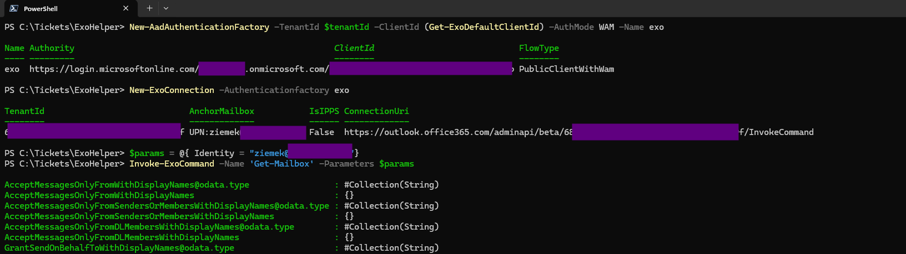

+++
date = '2026-07-04T11:12:23+02:00'
draft = false
title = 'ExoHelper: Lightweight EXO Access Without ExchangeOnlineManagement'
description = "Calling Exchange Online REST API directly from PowerShell without the heavy ExchangeOnlineManagement module"
tags = ["powershell", "exchange-online", "microsoft-365", "rest-api", "exo"]
categories = ["PowerShell"]
+++

## The Discovery

I was quite surprised when I stumbled across this module on PSGallery:
[ExoHelper](https://www.powershellgallery.com/packages/ExoHelper)

> Simple wrapper module that directly calls EXO REST API without the need for full heavy-weight ExchangeOnlineManagement module

That description alone made me stop and read more.

## What Is ExoHelper?

ExoHelper is a PowerShell module that talks directly to the Exchange Online REST API — the same underlying API that the official `ExchangeOnlineManagement` module uses under the hood since v3. The difference is that ExoHelper skips all the scaffolding of the full module and lets you call EXO cmdlets with a much lighter footprint.

No `Connect-ExchangeOnline`. No pulling in a large module with its own dependency chain. Just authenticate, connect, invoke.

## How It Works

The module follows a three-step pattern:

1. **Authenticate** — create an AAD authentication factory. ExoHelper provides `Get-ExoDefaultClientId` so you don't have to look up the EXO app registration yourself.
2. **Connect** — pass the factory to `New-ExoConnection` to establish a REST session.
3. **Invoke** — call any EXO cmdlet by name using `Invoke-ExoCommand`, passing parameters as a hashtable.

## Example: Set-Mailbox Without Full Module

```powershell
$tenantId = 'mydomain.onmicrosoft.com'
New-AadAuthenticationFactory -TenantId $tenantId -ClientId (Get-ExoDefaultClientId) -AuthMode WAM -Name exo
New-ExoConnection -AuthenticationFactory exo

Invoke-ExoCommand -Name 'Set-Mailbox' -Parameters @{Identity = 'myuser@domain.com'; RetentionPolicy = 'MyRetentionPolicy'}
```

The `-AuthMode WAM` flag uses the Windows Authentication Manager — the same credential broker behind modern auth in Office apps — so on a domain-joined or Entra ID-joined machine this authenticates interactively without extra credential handling. What was funny - it even do not ask me for authentication (as I worked on Entra connected laptop - yes, I know, that user should have PS1 disabled).



## Why This Matters

Since `ExchangeOnlineManagement` v3, all cmdlets go through the EXO REST API — the old remote PowerShell endpoint is being retired. That means the official module and ExoHelper are calling the same thing. The difference is weight:

- In Azure Functions, containers, or CI/CD pipelines where you only need to flip one mailbox setting, installing the full official module adds up
- ExoHelper is a thin wrapper — install it, authenticate, done

Microsoft themselves document this API surface directly, including a [C# example for connecting to Exchange Online PowerShell](https://learn.microsoft.com/en-us/powershell/exchange/connect-to-exo-powershell-c-sharp?view=exchange-ps). So the API is stable, public, and intended for direct use — ExoHelper just makes it convenient from PowerShell.

## Closing Thought

I already knew that EXO management has moved to the REST API (especially now that [ExchangeOnlineManagement](https://learn.microsoft.com/en-us/powershell/exchange/exchange-online-powershell?view=exchange-ps) has fully switched). But seeing a clean, minimal wrapper published for it — one that makes direct REST access as simple as three lines — is some refreshing. Probably I never use it in real production environment - too big risk, and add additional load is usually for purpose. But worth to know it. Maybe I will take for some GoLang or Python clone (if there are still nobody build it yet).
